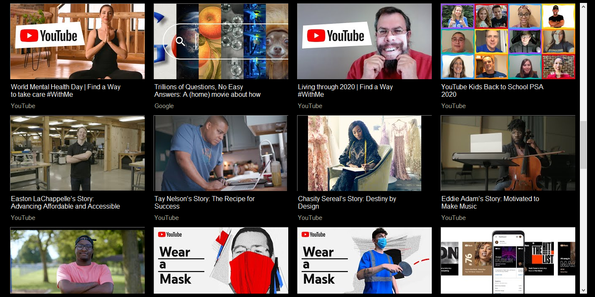

# PersonalizedYouTubeExperience

Creates a personalized YouTube experience by retrieving recent videos from specified channels

Used Python, along with the YouTube Data API and the PySimpleGUI library

